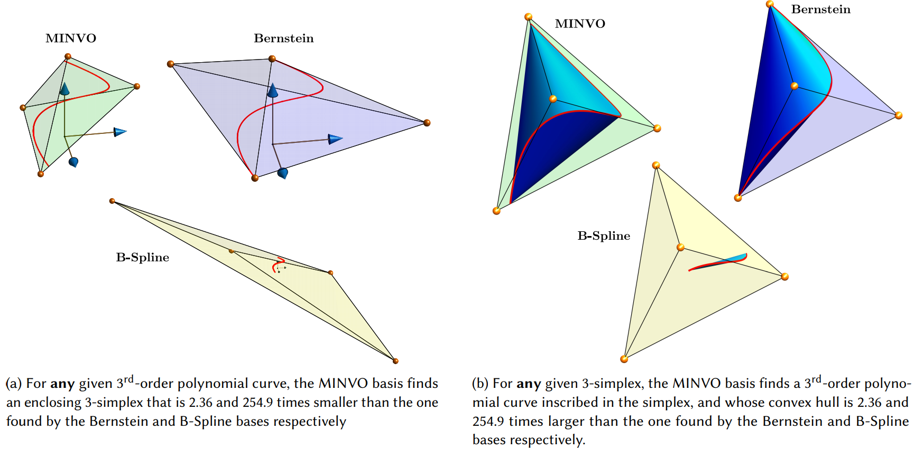

# MINVO Basis: Finding Simplexes with Minimum Volume Enclosing Polynomial Curves #

**The code has beeen released at [https://github.com/mit-acl/minvo](https://github.com/mit-acl/minvo)**

 

([pdf](https://arxiv.org/abs/2010.10726), [video](https://www.youtube.com/watch?v=f_JOYud9LUU))

